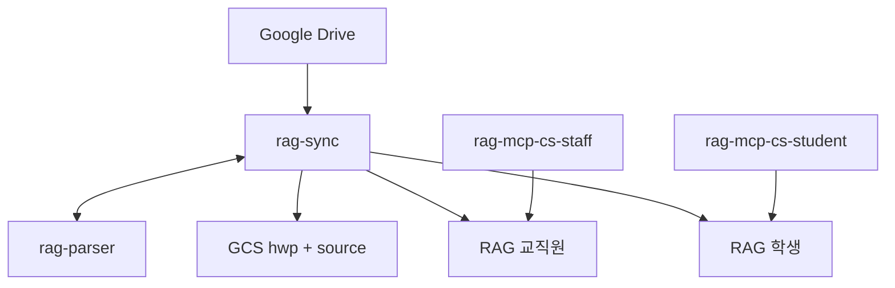

# RAG MCP

Drive → GCS → Vertex RAG → Cloud Run MCP `search`.

- 일 배치로 공유드라이브를 색인하고 FactChat에서 검색
- GCS hwp , source 각 1개. RAG 코퍼스와 MCP 서버 학생용, 직원용 각각 하나씩
- 명세: [`docs/DEV_SPEC.md`](docs/DEV_SPEC.md)



| 서비스 | 역할 | 공개 |
|---|---|---|
| `rag-parser` | HWP/HWPX → MD | IAM |
| `rag-sync` | Drive / GCS / RAG | IAM |
| `MCP_SERVICE_NAME_STAFF` | 교직원 `search` / `answer` | URL + 키 |
| `MCP_SERVICE_NAME_STUDENT` | 학생 (분리 켠 뒤) | URL + 키 |

일 배치: Scheduler 00:00 KST → Workflows → `rag-sync`.

---

## 배포 전

### 1. gcloud

- 설치: https://cloud.google.com/sdk/docs/install — 설치 후 터미널을 다시 연다
- 확인: `gcloud --version`
- 배포 스크립트는 PowerShell

```powershell
gcloud auth login
gcloud auth application-default login
gcloud config set project <GCP_PROJECT_ID>
```

### 2. GCP 실물 생성

스크립트는 **만들지 않는다.** 존재만 검사한다. 이미 있으면 다시 만들 필요 없음.

| 대상 | 비고 |
|---|---|
| GCS 버킷 2개 | 이름은 전역 고유 — 프로젝트 ID를 붙이면 안전 |
| Firestore Native DB | 이름·타입·리전 **생성 후 변경 불가**. `(default)` Datastore 불가 |
| Vertex RAG 코퍼스 | 콘솔에서 생성. 학생 분리를 켤 거면 2개 |
| 공유드라이브 공유 | Cloud Run SA `<프로젝트번호>-compute@developer.gserviceaccount.com` 를 뷰어 이상으로 초대 |

```powershell
gcloud storage buckets create gs://<hwp-original-bucket> --location=asia-northeast3 --uniform-bucket-level-access --pap
gcloud storage buckets create gs://<source-bucket> --location=asia-northeast3 --uniform-bucket-level-access --pap
gcloud firestore databases create --database=rag-sync-state --location=asia-northeast3 --type=firestore-native
```

- `--pap`(공개 접근 차단)와 `--uniform-bucket-level-access` 를 권장한다. hwp-original 에는 원본 공문이 상주한다
- 덮어쓰기를 되돌리려면 버전관리도 켠다(선택). `source` 버킷 덮어쓰기는 되돌릴 수 없다
  ```powershell
  gcloud storage buckets update gs://<bucket> --versioning
  ```
- 컬렉션(`doc_state` 등 5종)은 **만들 필요 없다** — 첫 쓰기 때 자동 생성
- DB `rag-sync-state`(하이픈)와 컬렉션 `doc_state`(언더바)는 다른 계층. DB ID 는 언더바를 못 쓴다

**코퍼스**

`gcloud` 에는 RAG 코퍼스 명령이 없다. **Vertex AI RAG 콘솔**에서 만든다.

- 만든 뒤 리소스 경로(`projects/.../locations/asia-northeast3/ragCorpora/{id}`)를 학과 yaml 의 `corpora` 에 넣는다
- **임베딩 모델과 벡터 DB는 생성 시점에만 정한다.** 나중에 못 바꾼다 — 바꾸려면 코퍼스를 새로 만들고 전량 재색인
- 한국어 문서라 다국어 임베딩(`text-multilingual-embedding-002`)을 쓴다
- 벡터 DB는 관리형(RAG Managed DB)과 Vertex Vector Search 중 선택. Vector Search 는 인덱스 엔드포인트가 **상시 과금**이고 코퍼스마다 인덱스가 따로 필요하다

### 3. `config/` 채우기

설정 원본은 `config/` **하나뿐이다** (`.env` 는 없앴다 — [docs/ENV_MIGRATION.md](docs/ENV_MIGRATION.md)).

| 파일 | 커밋 | 담는 것 |
|---|---|---|
| `config/common.yaml` | O | 학과 무관 공통값 (프로젝트·리전·Firestore·튜닝) |
| `config/departments/<학과>.yaml` | **X** (`.gitignore`) | 코퍼스 ID, **MCP 키**, 버킷, 폴더 ID |
| `config/departments/dept.yaml.example` | O | 그 템플릿 |

```powershell
Copy-Item config\departments\dept.yaml.example config\departments\cs.yaml
python -c "import secrets;print(secrets.token_urlsafe(32))"   # 키 2개 생성
```

**학과 yaml 필수** — 하나라도 비거나 `CHANGE_ME` 가 남으면 배포가 거부됩니다.

| 키 | 값 |
|---|---|
| `corpora.staff` / `corpora.student` | 코퍼스 경로. **서로 달라야 한다** |
| `keys.staff` / `keys.student` | MCP 키. **서로 달라야 한다** |
| `drive.driveIds` | 공유드라이브 ID |
| `drive.syncFolderIds` | 수집 폴더 ID (`folders/` 뒤) |
| `buckets.hwpOriginal` / `buckets.source` | 학과 버킷. **짝으로** (생략하면 공용 상속) |

**조건부**

- `drive.studentFolderIds` 는 `syncFolderIds` 의 부분집합. 비우면 그 학과는 단일 코퍼스로 동작한다
- `minInstances` 는 학과당 상주 인스턴스 수. `1` 은 24시간 과금이다
- `QG_MODE`(common.yaml)는 `log` 유지. `fallback` 은 parser 이미지에 LibreOffice 가 없어 런타임에 실패한다

**주의**

- 학과 파일은 **git 으로 복구할 수 없다.** 백업은 각자 책임 — [config/departments/README.md](config/departments/README.md)
- 배포는 `--set-env-vars` 로 Cloud Run env 를 **통째로 치환**한다. 설정을 고쳤으면 반드시 재배포해야 반영된다
- 배포 스크립트는 학과를 순회하며 env 를 매번 비운다 — 셸에 값을 미리 넣어 두는 방식은 통하지 않는다

### 4. preflight

```powershell
.\scripts\preflight.ps1
```

실물을 조회한다. 전부 통과할 때까지 배포하지 말 것.

| 검사 | 실패 시 |
|---|---|
| 버킷 2개 존재 | 생성 명령을 힌트로 출력 |
| Firestore 존재 + `FIRESTORE_NATIVE` | 없음 / Datastore 모드를 구분해서 알려줌 |
| RAG 코퍼스 존재 (교직원 + 학생) | 코퍼스 경로 확인 |
| Cloud Run SA 해석 | 프로젝트 번호 조회 실패 |
| Drive 에 SA 멤버십 | 토큰에 Drive 스코프가 없으면 WARN 으로 넘어감 |
| Document AI processor | `QG_MODE=fallback` 일 때만 |

- `deploy.ps1` 도 API enable 뒤 같은 검사를 돌린다
- 건너뛰기: `$env:SKIP_PREFLIGHT = "1"`

---

## 배포

### 두 스크립트의 차이

| | `deploy.ps1` | `deploy_mcp.ps1` |
|---|---|---|
| 빌드 | parser · sync · mcp (3개) | mcp (1개) |
| Cloud Run | `rag-parser` `rag-sync` **MCP(교직원 + 학생)** | **MCP 1개** (타깃 지정) |
| MCP 공개 여부 | `ALLOW_UNAUTH` (기본 공개) | 〃 (같은 스위치) |
| Workflows · Scheduler · IAM | 만든다 | 안 건드린다 |

- **`deploy.ps1` 한 번이면 FactChat 연결까지 끝난다** — MCP 가 공개(`ALLOW_UNAUTH=true`, 기본)로 올라간다
- 학생 분리(`RAG_CORPUS_NAME_STUDENT` + `STUDENT_FOLDER_IDS`)가 켜져 있으면 **학생 MCP 도 같이** 올린다. `MCP_API_KEY_STUDENT` 가 비면 배포 전에 거부된다
- `deploy_mcp.ps1` 은 **MCP 만 재배포**할 때 쓴다 (검색 파라미터·키 교체 등)
- `ALLOW_UNAUTH=false` 로 두면 IAM 전용이 되고 FactChat 은 붙지 못한다
- **공개 MCP 의 경계는 API 키뿐이다.** 키가 새면 그 코퍼스 전량이 열린다 — 교직원 키는 특히 주의

### 1) 전체

```powershell
.\scripts\deploy.ps1
```

- **`-Dept` 인자는 없다.** `config/departments` 의 학과 목록이 곧 배포 대상이다
- 올라가는 것: `rag-parser` 1개 · `rag-sync` 1개 · MCP **2N개**(학과 x 교직원/학생) · Workflows · Scheduler
- MCP 는 `deploy_mcp.ps1 -All` 에 위임한다 — 이미지는 한 번만 빌드하고 그 digest 를 전 학과에 쓴다
- 끝나면 `PARSER_URL` `SYNC_URL` 과 학과별 MCP URL 표를 출력한다
- MCP 서버는 기동 시점의 코퍼스 하나만 본다. 그래서 학과 x 대상 = 서비스 한 벌씩
- `-SkipMcp` 로 parser/sync 만, `-ShowKeys` 로 요약표에 키 노출

### 2) MCP 만 재배포 (필요할 때)

검색 파라미터·키만 바꿨으면 이미지 하나만 다시 빌드한다.

**학과별 배포 (권장)** — 설정은 `config/departments/<학과>.yaml` 에서 온다:

```powershell
.\scripts\deploy_mcp.ps1 -Dept cs                    # 교직원
.\scripts\deploy_mcp.ps1 -Dept cs -Audience student  # 학생
.\scripts\deploy_mcp.ps1 -All                        # 전 학과 x 양쪽
```

- 코퍼스·키·버킷 모두 학과 yaml 이 원본이다. `-Dept` 또는 `-All` 이 **필수**
- `-All` 은 이미지를 **한 번만** 빌드하고 같은 digest 를 전 학과에 배포한다.
  학과마다 빌드하면 requirements 가 범위 지정이라 학과별로 다른 의존성이 잡힐 수 있다
- 요약표의 키는 기본으로 가려진다. 필요하면 `-ShowKeys`
- 자세한 것은 [config/departments/README.md](config/departments/README.md)

### 3) FactChat 커넥터

- URL: `{MCP_URL}/mcp`
- Transport: Streamable HTTP
- Header: `Authorization: Bearer {키}` 또는 `X-API-Key: {키}`
- 확인: `curl -s {MCP_URL}/health`

### 첫 색인 · 수동 동기화

배포만으로는 색인이 비어 있다. Scheduler 는 **00:00 KST** 에 처음 돈다.

기다리지 않으려면 워크플로를 직접 실행한다.

```powershell
$P = $env:GCP_PROJECT_ID; $R = "asia-northeast3"
$SYNC   = (gcloud run services describe rag-sync   --region=$R --project=$P --format="value(status.url)").Trim()
$PARSER = (gcloud run services describe rag-parser --region=$R --project=$P --format="value(status.url)").Trim()

# 첫 적재 = 전체 백필
gcloud workflows run rag-daily-sync --location=$R --project=$P `
  --data="{\"syncUrl\":\"$SYNC\",\"parserUrl\":\"$PARSER\",\"driveIds\":[\"<공유드라이브ID>\"],\"backfill\":true}"
```

| 인자 | 기본 | 뜻 |
|---|---|---|
| `backfill` | `false` | `true` = 전체 재수집. **처음엔 이걸로** |
| `maxChanges` | 200 | 델타 1페이지당 변경 수 (Workflows 변수 512KB 한도 대비) |
| `indexBatchSize` | 10 | RAG import 배치 |
| `recoverLimit` | 200 | DLQ 회수 상한 |

- `backfill` 없이 돌리면 델타 모드다. 다만 **최초 토큰이 없으면 자동으로 백필 스냅샷**을 탄다
- 콘솔에서도 된다: Workflows → `rag-daily-sync` → 실행 → 위 JSON 붙여넣기

진행 확인:

```powershell
gcloud workflows executions list --workflow=rag-daily-sync --location=$R --project=$P --limit=3
gcloud logging read 'resource.labels.service_name="rag-sync"' --project=$P --limit=30
```

---

## 학생 분리

- 스위치: 학과 yaml 의 `corpora.student` + `drive.studentFolderIds` (`syncFolderIds` 의 부분집합)
- 하나라도 비면 단일 코퍼스로 동작한다
- 포함 관계: 교직원 코퍼스 ⊇ 학생 코퍼스

**신규 배포**라면 학과 yaml 에 `corpora.student` 와 `drive.studentFolderIds` 를 넣고
위 배포 순서를 그대로 따르면 된다.

**이미 색인이 돌아간 뒤**에 켜는 경우는 순서를 지켜야 한다.

1. 학과 yaml 에 두 값 넣고 `rag-sync` 재배포 (`.\scripts\deploy.ps1`)
2. 기존 INDEXED 문서의 `audience` 일괄 기록
   - `audience` 는 ingest 시점에만 기록된다
   - 이미 INDEXED 인 문서는 ingest 초입에서 UNCHANGED 로 빠져 그 코드에 도달하지 못한다
   - **건너뛰면 학생 코퍼스가 빈 채로 동작한다**
3. 학생 코퍼스 적재
4. 학생 MCP 배포

4를 먼저 하면 학생에게 빈 검색을 준다.
