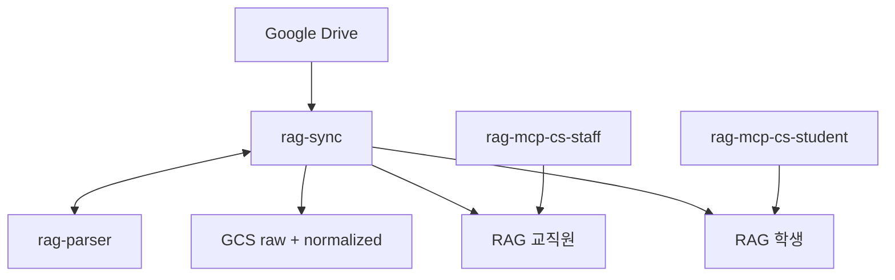

# RAG MCP

Drive → GCS → Vertex RAG → Cloud Run MCP `search`.

- 일 배치로 공유드라이브를 색인하고 FactChat에서 검색
- GCS hwp , source 각 1개. RAG 코퍼스와 MCP 서버 학생용, 직원용 각각 하나씩
- 명세: [`docs/DEV_SPEC.md`](docs/DEV_SPEC.md)



| 서비스 | 역할 | 공개 |
|---|---|---|
| `rag-parser` | HWP/HWPX → MD | IAM |
| `rag-sync` | Drive / GCS / RAG | IAM |
| `MCP_SERVICE_NAME_STAFF` | 교직원 `search` / `answer` | URL + 키 |
| `MCP_SERVICE_NAME_STUDENT` | 학생 (분리 켠 뒤) | URL + 키 |

일 배치: Scheduler 00:00 KST → Workflows → `rag-sync`.

---

## 배포 전

Google Cloud SDK (`gcloud`) 설치 후 터미널을 다시 연다.

- Windows: https://cloud.google.com/sdk/docs/install
- 확인: `gcloud --version`

로그인 (브라우저가 열림):

```powershell
gcloud auth login
gcloud auth application-default login
gcloud config set project <GCP_PROJECT_ID>
```

배포 스크립트는 PowerShell.

스크립트 실행 전 사전 생성 (GCP)

1. GCS 버킷 2개 (`hwp 변환용`, `normalized`)
2. Firestore **Native** DB `doc-state` (`(default)` Datastore 불가)
3. Vertex AI RAG 코퍼스 (`projects/.../locations/asia-northeast3/ragCorpora/...`)
4. 공유드라이브를 Cloud Run SA에 공유 (`<프로젝트번호>-compute@developer.gserviceaccount.com`)

```powershell
Copy-Item .env.example .env
```

`.env` 채운 뒤 배포. 스크립트가 시작 시 필수값·`.env.example` 잔존값을 검사한다.

- 값에 따옴표 넣지 말 것. `MCP_SERVICE_NAME`(이번 실행 타깃)은 `.env`에 두지 말 것

---

## 배포

#### parser + sync + 교직원 MCP + Scheduler

```powershell
.\scripts\deploy.ps1
```

#### FactChat용 MCP 

```powershell
.\scripts\deploy_mcp.ps1
```

- 커넥터 
  - URL: `{MCP_URL}/mcp`
  - Transport: Streamable HTTP
  - Header: `Authorization: Bearer {키}` 또는 `X-API-Key`

---

## 학생 분리 

스위치: `RAG_CORPUS_NAME_STUDENT` + `STUDENT_FOLDER_IDS` (`SYNC`의 부분집합). 하나라도 비면 단일 코퍼스.

1. `.env`에 두 값 넣고 `rag-sync` 재배포
2. 기존 INDEXED `audience` 일괄 기록 (건너면 학생 코퍼스 빔)
3. 학생 코퍼스 적재
4. 학생 MCP

```powershell
$env:MCP_AUDIENCE = "student"
.\scripts\deploy_mcp.ps1
```

`MCP_API_KEY_STUDENT`는 교직원 키와 다른 값. 4를 먼저 하면 학생 검색이 빈다.
