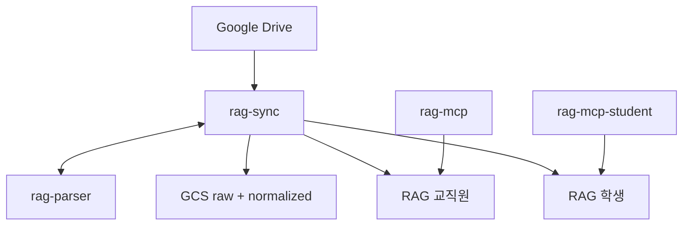

# RAG MCP

Drive → GCS → Vertex RAG → MCP `search`.

- 일 배치로 공유드라이브를 동기화하고 FactChat에서 검색
- GCS raw(hwp->md 변환용)/ normalized 각 1개. RAG 코퍼스와 MCP는 교직원·학생 2벌
- HWP/HWPX는 rhwp로 마크다운 변환

상세: [`docs/DEV_SPEC.md`](docs/DEV_SPEC.md)

## 구조



- `DRIVE_IDS`: 공유 드라이브
- `SYNC_FOLDER_IDS`: 수집 폴더. 비우면 드라이브 전체
- `STUDENT_FOLDER_IDS`: 학생 코퍼스에 실을 폴더 (`SYNC`의 부분집합)
- 교직원 코퍼스 = 전량. 학생 코퍼스 = `audience=STUDENT`만

| 서비스 | 역할 |
|---|---|
| `services/parser` | HWP/HWPX → MD |
| `services/sync` | Drive / GCS / RAG 오케스트레이션 |
| `services/mcp_server` | MCP `search` / `answer` |

## 일 배치

Scheduler 00:00 KST → Workflows → rag-sync

- `/sync/changes` 200건씩. 색인 성공 후에만 pageToken 커밋
- 토큰 없으면 `/sync/backfill-run`
- DELETE / SKIP / EXCLUDE / HWP_PARSE / GOOGLE_EXPORT / FILE_COPY
- `/sync/index-gcs` → 교직원 코퍼스 후 학생 코퍼스
- `/sync/reconcile` → `/sync/commit-token`

Workflows 변수 상한 때문에 델타를 끊음

## 품질 게이트

| 게이트 | 설정 |
|---|---|
| G1 밀도 | `QG_DENSITY_THRESHOLD=0.0005` |
| G2 표 손실 | `QG_TABLE_LOSS_RATIO=0.3` |
| EMPTY_TEXT | `QG_MIN_TEXT_LENGTH=20` |

- 기본 `QG_MODE=log`: 미달이어도 색인, 로그만
- `reject` / `fallback`(+`ENABLE_DOCAI_FALLBACK`)으로 전환 가능
- EMPTY_TEXT만 모드와 무관하게 422

## 로컬

```bash
# CPython 3.12. mingw/msys Python은 빌드 실패할 수 있음
pip install -r requirements-parser.txt
pip install -r requirements.txt
set PYTHONPATH=.
python scripts/hwp_to_md.py sample.hwp -o sample.md
```

## 배포
- 배포 전 `.env` 확인 필수
- parser / sync / 교직원 MCP + Scheduler: `scripts/deploy.sh`
- FactChat용 MCP만: `scripts/deploy_mcp.sh` 또는 `scripts/deploy_mcp.ps1` (`.env` 로드)
- 학생 MCP:

```bash
MCP_SERVICE_NAME=rag-mcp-student \
RAG_CORPUS_NAME="${RAG_CORPUS_NAME_STUDENT}" \
MCP_API_KEY="${MCP_API_KEY_STUDENT}" \
./scripts/deploy_mcp.sh
```

분리 스위치: `RAG_CORPUS_NAME_STUDENT` + `STUDENT_FOLDER_IDS`를 `rag-sync`에 배포. 기존 INDEXED는 `audience` 일괄 기록 후에 학생 코퍼스를 채운다.
