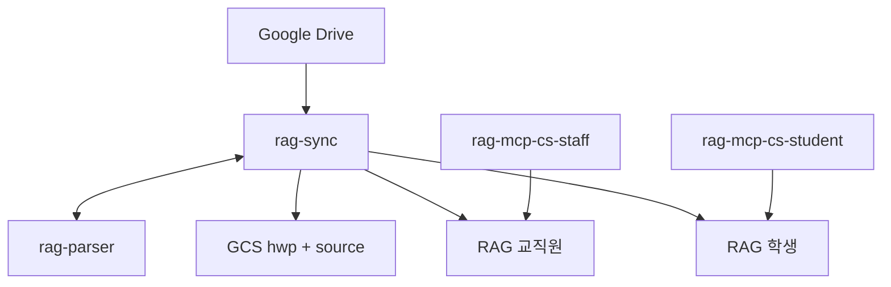

# RAG MCP

Drive → GCS → Vertex RAG → Cloud Run MCP `search`.

- 일 배치로 공유드라이브를 색인하고 FactChat에서 검색
- GCS hwp , source 각 1개. RAG 코퍼스와 MCP 서버 학생용, 직원용 각각 하나씩
- 명세: [`docs/DEV_SPEC.md`](docs/DEV_SPEC.md)



| 서비스 | 역할 | 공개 |
|---|---|---|
| `rag-parser` | HWP/HWPX → MD | IAM |
| `rag-sync` | Drive / GCS / RAG | IAM |
| `MCP_SERVICE_NAME_STAFF` | 교직원 `search` / `answer` | URL + 키 |
| `MCP_SERVICE_NAME_STUDENT` | 학생 (분리 켠 뒤) | URL + 키 |

일 배치: Scheduler 00:00 KST → Workflows → `rag-sync`.

---

## 배포 전

### 1. gcloud

- 설치: https://cloud.google.com/sdk/docs/install — 설치 후 터미널을 다시 연다
- 확인: `gcloud --version`
- 배포 스크립트는 PowerShell

```powershell
gcloud auth login
gcloud auth application-default login
gcloud config set project <GCP_PROJECT_ID>
```

### 2. GCP 리소스 준비

학과 관리 웹 콘솔(`python scripts/dept_gui.py`)에서 학과별 버킷과 코퍼스를 기존
목록에서 선택하거나 직접 생성할 수 있다. 상태 확인은 읽기 전용이며, 실제 생성은
계획을 확인한 뒤 `리소스 만들기`를 눌렀을 때만 실행된다.

| 대상 | 비고 |
|---|---|
| GCS 버킷 2개 | 웹 콘솔에서 보호 기본값으로 생성 또는 기존 버킷 선택 |
| Firestore Native DB | 이름·타입·리전 **생성 후 변경 불가**. `(default)` Datastore 불가 |
| Vertex RAG 코퍼스 | 웹 콘솔에서 교직원·학생 2개 생성 또는 기존 코퍼스 선택 |
| 공유드라이브 공유 | Cloud Run SA `<프로젝트번호>-compute@developer.gserviceaccount.com` 를 뷰어 이상으로 초대 |

```powershell
gcloud storage buckets create gs://<hwp-original-bucket> --location=asia-northeast3 --uniform-bucket-level-access --pap
gcloud storage buckets create gs://<source-bucket> --location=asia-northeast3 --uniform-bucket-level-access --pap
gcloud firestore databases create --database=rag-sync-state --location=asia-northeast3 --type=firestore-native
```

**공유드라이브에 서비스 계정 초대 (콘솔)**

Drive 권한은 GCP IAM 과 **별개 체계**다. 프로젝트 소유자여도 공유드라이브 접근이
자동으로 생기지 않으므로 여기서 직접 넣어야 한다. 안 넣으면 배포는 통과하고
색인만 0건으로 끝난다 — preflight 는 확인이 막히면 WARN 으로 넘어간다.

1. 초대할 계정 확인 (Cloud Run 기본 SA)

   ```powershell
   gcloud projects describe <프로젝트ID> --format="value(projectNumber)"
   # -> <프로젝트번호>-compute@developer.gserviceaccount.com
   ```

2. [drive.google.com](https://drive.google.com) → 해당 **공유드라이브** 선택
3. 이름 우클릭(또는 우상단 ⋮) → **멤버 관리**
4. 위 SA 이메일 입력 → 역할 **뷰어** → **보내기**
   - 알림 메일 체크는 꺼도 된다 (SA 는 메일함이 없다)
   - 학과를 늘리면 **드라이브마다** 반복해야 한다
5. 확인

   ```powershell
   .\scripts\preflight.ps1     # ok Drive <driveId> share(...) 가 뜨면 됨
   ```

> **`share_drive.ps1` 은 왜 안 쓰나**
> 스크립트로도 초대할 수 있지만 토큰에 Drive 스코프가 있어야 하고,
> **gcloud 내장 OAuth 클라이언트는 Drive 스코프를 못 받는다** — 별도 OAuth
> 클라이언트를 만들어 `--client-id-file` 로 넘겨야 한다
> (`gcloud auth application-default login --help` 에 명시돼 있다).
> 드라이브가 몇 개뿐이면 콘솔이 빠르다. 스크립트는 드라이브가 많아졌을 때 쓴다.

- `--pap`(공개 접근 차단)와 `--uniform-bucket-level-access` 를 권장한다. hwp-original 에는 원본 공문이 상주한다
- 덮어쓰기를 되돌리려면 버전관리도 켠다(선택). `source` 버킷 덮어쓰기는 되돌릴 수 없다
  ```powershell
  gcloud storage buckets update gs://<bucket> --versioning
  ```
- 컬렉션(`doc_state` 등 5종)은 **만들 필요 없다** — 첫 쓰기 때 자동 생성
- DB `rag-sync-state`(하이픈)와 컬렉션 `doc_state`(언더바)는 다른 계층. DB ID 는 언더바를 못 쓴다

**코퍼스**

`gcloud` 전용 코퍼스 명령 대신 학과 관리 웹 콘솔이 Vertex AI API를 호출한다.
생성 완료 후 리소스 경로(`projects/.../locations/asia-northeast3/ragCorpora/{id}`)를
학과 입력란에 자동으로 선택한다.
- **임베딩 모델과 벡터 DB는 생성 시점에만 정한다.** 나중에 못 바꾼다 — 바꾸려면 코퍼스를 새로 만들고 전량 재색인
- 한국어 문서라 다국어 임베딩(`text-multilingual-embedding-002`)을 쓴다
- 벡터 DB는 관리형(RAG Managed DB)과 Vertex Vector Search 중 선택. Vector Search 는 인덱스 엔드포인트가 **상시 과금**이고 코퍼스마다 인덱스가 따로 필요하다

### 3. `config/` 채우기

설정 원본은 `config/` **하나뿐이다** (`.env` 는 없앴다 — [docs/ENV_MIGRATION.md](docs/ENV_MIGRATION.md)).

| 파일 | 커밋 | 담는 것 |
|---|---|---|
| `config/common.yaml` | O | 학과 무관 공통값 (프로젝트·리전·Firestore·튜닝) |
| `config/departments/<학과>.yaml` | **X** (`.gitignore`) | 코퍼스 ID, **MCP 키**, 버킷, 폴더 ID |
| `config/departments/dept.yaml.example` | O | 그 템플릿 |

```powershell
Copy-Item config\departments\dept.yaml.example config\departments\cs.yaml
python -c "import secrets;print(secrets.token_urlsafe(32))"   # 키 2개 생성
```

**학과 yaml 필수** — 하나라도 비거나 `CHANGE_ME` 가 남으면 배포가 거부됩니다.

| 키 | 값 |
|---|---|
| `corpora.staff` | 단일·분리 모드 모두 사용하는 기본 코퍼스 경로 |
| `keys.staff` | 기본 MCP 키 |
| `drive.driveIds` | 공유드라이브 ID |
| `drive.syncFolderIds` | 수집 폴더 ID (`folders/` 뒤) |
| `buckets.hwpOriginal` / `buckets.source` | 학과 버킷. **짝으로** (생략하면 공용 상속) |

**조건부**

- GUI의 `단일 코퍼스`를 선택하면 `corpora.student`, `drive.studentFolderIds`, `keys.student`를 만들지 않는다
- 학생 분리는 위 세 값을 모두 설정하며, `studentFolderIds` 는 `syncFolderIds` 의 부분집합이어야 한다
- `minInstances` 는 학과당 상주 인스턴스 수. `1` 은 24시간 과금이다
- `QG_MODE`(common.yaml)는 `log` 유지. `fallback` 은 parser 이미지에 LibreOffice 가 없어 런타임에 실패한다

**주의**

- 학과 파일은 **git 으로 복구할 수 없다.** 백업은 각자 책임 — [config/departments/README.md](config/departments/README.md)
- 배포는 `--set-env-vars` 로 Cloud Run env 를 **통째로 치환**한다. 설정을 고쳤으면 반드시 재배포해야 반영된다
- 배포 스크립트는 학과를 순회하며 env 를 매번 비운다 — 셸에 값을 미리 넣어 두는 방식은 통하지 않는다

### 4. preflight

```powershell
.\scripts\preflight.ps1
```

실물을 조회한다. 전부 통과할 때까지 배포하지 말 것.

| 검사 | 실패 시 |
|---|---|
| 버킷 2개 존재 | 생성 명령을 힌트로 출력 |
| Firestore 존재 + `FIRESTORE_NATIVE` | 없음 / Datastore 모드를 구분해서 알려줌 |
| RAG 코퍼스 존재 (교직원 + 학생) | 코퍼스 경로 확인 |
| Cloud Run SA 해석 | 프로젝트 번호 조회 실패 |
| Drive 에 SA 멤버십 | 토큰에 Drive 스코프가 없으면 WARN 으로 넘어감 — **통과가 아니다**. 위 2단계 콘솔 절차로 직접 확인할 것 |
| Document AI processor | `QG_MODE=fallback` 일 때만 |

- `deploy.ps1` 도 API enable 뒤 같은 검사를 돌린다
- 건너뛰기: `$env:SKIP_PREFLIGHT = "1"`

---

## 배포

### 두 스크립트의 차이

| | `deploy.ps1` | `deploy_mcp.ps1` |
|---|---|---|
| 빌드 | parser · sync · mcp (3개) | mcp (1개) |
| Cloud Run | `rag-parser` `rag-sync` **MCP(교직원 + 학생)** | **MCP 1개** (타깃 지정) |
| MCP 공개 여부 | `ALLOW_UNAUTH` (기본 공개) | 〃 (같은 스위치) |
| Workflows · Scheduler · IAM | 만든다 | 안 건드린다 |

- **`deploy.ps1` 한 번이면 FactChat 연결까지 끝난다** — MCP 가 공개(`ALLOW_UNAUTH=true`, 기본)로 올라간다
- 로컬 관리 GUI에서도 학과 생성 직후 또는 상태 상세의 `미배포` 항목에서 학과 MCP만
  배포할 수 있다. 기존 Artifact Registry 이미지를 우선 재사용하고 단계별 상태를 표시한다
- 학생 분리(`RAG_CORPUS_NAME_STUDENT` + `STUDENT_FOLDER_IDS`)가 켜져 있으면 **학생 MCP 도 같이** 올린다. `MCP_API_KEY_STUDENT` 가 비면 배포 전에 거부된다
- `deploy_mcp.ps1` 은 **MCP 만 재배포**할 때 쓴다 (검색 파라미터·키 교체 등)
- `ALLOW_UNAUTH=false` 로 두면 IAM 전용이 되고 FactChat 은 붙지 못한다
- **공개 MCP 의 경계는 API 키뿐이다.** 키가 새면 그 코퍼스 전량이 열린다 — 교직원 키는 특히 주의
- MCP 배포에는 관리 라벨과 비밀값 없는 메타데이터 주석도 기록한다. 다른 운영 PC에서
  같은 프로젝트·리전으로 로그인하면 로컬 학과 YAML 없이도 배포된 학과, 코퍼스, 버킷,
  Drive 범위와 Cloud Run Ready 상태를 콘솔에서 읽기 전용으로 확인할 수 있다. MCP 키는
  메타데이터에 넣지 않는다
- 최초 공통 환경설정은 `rag-parser`·`rag-sync` 존재 여부도 확인한다. 이미 있으면
  유지하고, 없으면 학과가 없는 빈 라우팅 상태로 공용 서비스만 먼저 배포한다
- 이후 학과 추가는 공용 `rag-sync`의 학과 맵을 갱신하고 학과별 MCP만 늘린다.
  `rag-parser`는 공통 코드나 실행 설정이 바뀔 때만 다시 배포한다

### 1) 전체

```powershell
.\scripts\deploy.ps1
```

- **`-Dept` 인자는 없다.** `config/departments` 의 학과 목록이 곧 배포 대상이다
- 올라가는 것: `rag-parser` 1개 · `rag-sync` 1개 · MCP **2N개**(학과 x 교직원/학생) · Workflows · Scheduler
- MCP 는 `deploy_mcp.ps1 -All` 에 위임한다 — 이미지는 한 번만 빌드하고 그 digest 를 전 학과에 쓴다
- 끝나면 `PARSER_URL` `SYNC_URL` 과 학과별 MCP URL 표를 출력한다
- MCP 서버는 기동 시점의 코퍼스 하나만 본다. 그래서 학과 x 대상 = 서비스 한 벌씩
- `-SkipMcp` 로 parser/sync 만, `-ShowKeys` 로 요약표에 키 노출

### 2) MCP 만 재배포 (필요할 때)

검색 파라미터·키만 바꿨으면 이미지 하나만 다시 빌드한다.

**학과별 배포 (권장)** — 설정은 `config/departments/<학과>.yaml` 에서 온다:

```powershell
.\scripts\deploy_mcp.ps1 -Dept cs                    # 교직원
.\scripts\deploy_mcp.ps1 -Dept cs -Audience student  # 학생
.\scripts\deploy_mcp.ps1 -All                        # 전 학과 x 양쪽
```

- 코퍼스·키·버킷 모두 학과 yaml 이 원본이다. `-Dept` 또는 `-All` 이 **필수**
- `-All` 은 이미지를 **한 번만** 빌드하고 같은 digest 를 전 학과에 배포한다.
  학과마다 빌드하면 requirements 가 범위 지정이라 학과별로 다른 의존성이 잡힐 수 있다
- 요약표의 키는 기본으로 가려진다. 필요하면 `-ShowKeys`
- 자세한 것은 [config/departments/README.md](config/departments/README.md)

### 3) FactChat 커넥터

- URL: `{MCP_URL}/mcp`
- Transport: Streamable HTTP
- Header: `Authorization: Bearer {키}` 또는 `X-API-Key: {키}`
- 확인: `curl -s {MCP_URL}/health`

### 첫 색인 · 수동 동기화

배포만으로는 색인이 비어 있다. Scheduler 는 **00:00 KST** 에 처음 돈다.

기다리지 않으려면 워크플로를 직접 실행한다.

```powershell
$P = $env:GCP_PROJECT_ID; $R = "asia-northeast3"
$SYNC   = (gcloud run services describe rag-sync   --region=$R --project=$P --format="value(status.url)").Trim()
$PARSER = (gcloud run services describe rag-parser --region=$R --project=$P --format="value(status.url)").Trim()

# 첫 적재 = 전체 백필
gcloud workflows run rag-daily-sync --location=$R --project=$P `
  --data="{\"syncUrl\":\"$SYNC\",\"parserUrl\":\"$PARSER\",\"driveIds\":[\"<공유드라이브ID>\"],\"backfill\":true}"
```

| 인자 | 기본 | 뜻 |
|---|---|---|
| `backfill` | `false` | `true` = 전체 재수집. **처음엔 이걸로** |
| `maxChanges` | 200 | 델타 1페이지당 변경 수 (Workflows 변수 512KB 한도 대비) |
| `indexBatchSize` | 24 | RAG import 배치(복구 API 상한 25 이하) |
| `runRecovery` | `false` | `true`일 때 과거 미색인·실패 문서 복구 실행 |
| `recoverLimit` | 200 | `runRecovery=true` 실행의 회수 상한 |

- `backfill` 없이 돌리면 델타 모드다. 다만 **최초 토큰이 없으면 자동으로 백필 스냅샷**을 탄다
- 과거 미색인·실패 문서 복구는 일반 동기화와 분리되어 있다. 필요할 때 `runRecovery:true`로 별도 실행한다
- 콘솔에서도 된다: Workflows → `rag-daily-sync` → 실행 → 위 JSON 붙여넣기

진행 확인:

```powershell
gcloud workflows executions list --workflow=rag-daily-sync --location=$R --project=$P --limit=3
gcloud logging read 'resource.labels.service_name="rag-sync"' --project=$P --limit=30
```

### RAG 파일 매핑과 삭제 성능

`rag-sync`는 Vertex import 결과를 `doc_state/{driveFileId}/rag_files`에 기록한다.
삭제·수정 시 이 매핑으로 RagFile resource name을 바로 찾아 코퍼스 전체 순회를
피한다. `RAG_MAPPING_FALLBACK_SCAN_ENABLED=true`인 동안 매핑이 없는 파일만 기존
전체 스캔으로 안전하게 보완한다.

기존 코퍼스는 읽기 전환 전에 다음 관리 API를 `dryRun=true`로 확인한 뒤
`false`로 한 번 backfill한다.

```json
{"driveId":"<공유드라이브ID>","dryRun":true}
```

호출 경로는 `POST /sync/backfill-rag-mappings`다. `listed == mappable`,
`skipped == 0`을 확인한 뒤 적용한다. 운영 스위치는 다음과 같다.

- `RAG_MAPPING_WRITE_ENABLED`: Vertex import result sink를 Firestore에 기록
- `RAG_MAPPING_READ_ENABLED`: 삭제 시 Firestore 매핑을 우선 사용
- `RAG_MAPPING_FALLBACK_SCAN_ENABLED`: 매핑 누락 시 코퍼스 스캔 허용
- `RAG_METADATA_BUCKET`: import result NDJSON 임시 보관 버킷

### 비동기 코퍼스 색인

변경분 색인은 `POST /sync/index-gcs-async`가 job을 만든 뒤 교직원·학생 코퍼스를
각각 `faculty-rag-sync-queue`, `student-rag-sync-queue`로 보낸다. 두 파트는 서로
독립적으로 재시도되며 모두 성공한 뒤에만 job이 `DONE`, 문서가 `INDEXED`가 된다.
Workflow는 `GET /sync/index-jobs/{jobId}`를 폴링하고 `DONE`일 때만 pageToken을
커밋한다.

큐 기본값은 코퍼스별 동시 실행 1, 시작률 0.2/s, 최대 5회, backoff 2~60초다.
한 코퍼스가 동시 import/delete를 받지 않도록 동시성을 1로 유지한다.

---

## 학생 분리

- 스위치: 학과 yaml 의 `corpora.student` + `drive.studentFolderIds` (`syncFolderIds` 의 부분집합)
- 하나라도 비면 단일 코퍼스로 동작한다
- 포함 관계: 교직원 코퍼스 ⊇ 학생 코퍼스

**신규 배포**라면 학과 yaml 에 `corpora.student` 와 `drive.studentFolderIds` 를 넣고
위 배포 순서를 그대로 따르면 된다.

**이미 색인이 돌아간 뒤**에 켜는 경우는 순서를 지켜야 한다.

1. 학과 yaml 에 두 값 넣고 `rag-sync` 재배포 (`.\scripts\deploy.ps1`)
2. 기존 INDEXED 문서의 `audience` 일괄 기록
   - `audience` 는 ingest 시점에만 기록된다
   - 이미 INDEXED 인 문서는 ingest 초입에서 UNCHANGED 로 빠져 그 코드에 도달하지 못한다
   - **건너뛰면 학생 코퍼스가 빈 채로 동작한다**
3. 학생 코퍼스 적재
4. 학생 MCP 배포

4를 먼저 하면 학생에게 빈 검색을 준다.
