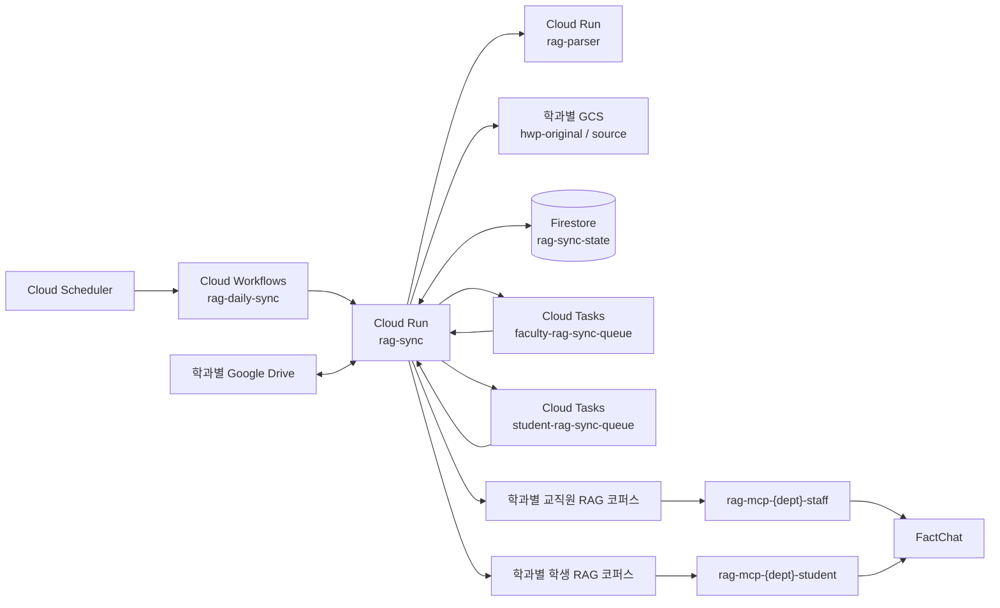

# 문서 검색(RAG) 시스템 개발 명세

- 최종 개정: 2026-09-01
- 대상: 한국공학대학교 학과별 문서 검색 파이프라인
- 기준: 현재 저장소 코드와 운영 설정

이 문서는 시스템이 **현재 어떻게 동작하는지**를 설명한다. 과거 실측값은 기준일을
명시한 참고 자료이며, 현재 운영 건수나 성능 보장을 뜻하지 않는다.

## 1. 목적과 범위

Google Drive의 학과 문서를 수집·변환하여 Vertex AI RAG Engine에 색인하고,
FactChat이 MCP를 통해 문서를 검색할 수 있게 한다.

포함 범위:

- 공유 Drive 변경분 조회 및 전체 백필
- HWP/HWPX md변환 및 문서의 GCS 적재
- 학과별 교직원·학생 코퍼스 분리 
- Cloud Tasks 기반 코퍼스별 비동기 색인과 재시도
- Firestore 기반 문서 상태, 실행 상태, Drive file ID ↔ RagFile 매핑
- 벡터 검색, 어휘 재정렬, 문서·청크 단위 후처리
- MCP의 `search`, `answer` 도구
- 학과 설정과 운영 상태를 확인하는 로컬 관리 콘솔

제외 범위:

- 최종 답변 문장 생성: Fact Chat의 LLM을 사용, RAG서버만 운용.
- 문서별 ACL: 현재 경계는 Drive 폴더 - 교직원·학생 코퍼스로 나뉨
- ZIP 내부 문서 자동 해제
- 스캔 문서 OCR (구글 DocAI Fallback 필요) 

## 2. 현재 아키텍처



구성 원칙:

- `rag-sync`, `rag-parser`, Workflow, Scheduler, Firestore, metadata 버킷과
  Cloud Tasks 큐는 공용이다.
- Drive 범위, GCS 버킷, RAG 코퍼스와 MCP 서비스는 학과별로 분리한다.
- `DEPARTMENTS_JSON`이 Drive ID를 학과 설정으로 라우팅한다. 등록되지 않은
  Drive를 기본 학과로 보내지 않고 실패시켜 자료 혼입을 막는다.
- 교직원 코퍼스는 해당 학과의 동기화 대상 전체를 담는다.
- 학생 코퍼스는 `studentFolderIds` 아래 문서만 담는다.
- 따라서 정상 상태에서는 `교직원 코퍼스 ⊇ 학생 코퍼스`다.
- RAG 입력은 항상 GCS URI다. Drive 커넥터를 직접 사용하지 않는다.

### 주요 런타임

| 구성요소 | 현재 배포값 | 역할 |
|---|---|---|
| `rag-sync` | 2 CPU, 2GiB, timeout 3600초, concurrency 4 | 변경 조회, 변환 조정, 상태 관리, 색인 작업 처리 |
| `rag-parser` | 2 CPU, 2GiB, timeout 540초, concurrency 4, max instances 10 | HWP/HWPX → Markdown |
| `rag-mcp-{dept}-{audience}` | 1 CPU, 1GiB, timeout 60초, concurrency 40 | 코퍼스 검색을 MCP로 제공 |
| faculty/student 큐 | 큐별 concurrency 1, 0.2 dispatch/s | 동일 코퍼스 요청 직렬화와 재시도 |

모든 Cloud Tasks 요청은 OIDC로 `rag-sync`의 내부 worker를 호출한다. 두 큐는
서로 다른 코퍼스를 담당하므로 병렬로 동작할 수 있지만, 같은 코퍼스 안에서는
동시에 import/delete하지 않는다.

## 3. 데이터와 상태

### 3.1 GCS

| 저장소 | 내용 |
|---|---|
| 학과별 `hwp-original` 버킷 | HWP/HWPX 원본. 파싱·재파싱에 사용 |
| 학과별 `source` 버킷 | RAG에 전달할 Markdown, 원본 통과 문서, 경로 sidecar |
| 공용 `RAG_METADATA_BUCKET` | Vertex import 결과 NDJSON. 30일 후 자동 삭제 |

주요 객체 키는 Drive `fileId`를 기준으로 만든다.

```text
gs://{hwp-original}/{fileId}.hwp
gs://{hwp-original}/{fileId}.hwpx
gs://{source}/{fileId}.md
gs://{source}/{fileId}.meta.md
gs://{source}/{fileId}.{pdf|docx|pptx|...}
```

`source` 객체에는 파일명·Drive 경로 등 검색 결과 복원에 필요한 메타데이터를
기록한다. 학과 격리는 객체 경로가 아니라 버킷으로 수행한다.

### 3.2 Firestore

데이터베이스는 Native mode의 `rag-sync-state`다.

| 경로 | 용도 |
|---|---|
| `doc_state/{driveFileId}` | 파일명, Drive, MIME, 해시, 경로, audience, 처리 상태, source URI |
| `doc_state/{driveFileId}/rag_files/{mappingId}` | 코퍼스별 Vertex RagFile resource 매핑 |
| `sync_tokens/{driveId}` | 마지막으로 확정한 Drive pageToken |
| `sync_jobs/{jobId}` | 백필·복구·비동기 색인 작업 상태 |
| `sync_jobs/{jobId}/parts/{faculty|student}` | 코퍼스별 작업 상태와 결과 |
| `doc_dlq/*` | 사람이 확인해야 하는 처리 실패 |
| `doc_split_queue/*` | 자동 처리하지 못한 크기 초과 문서 |

문서 상태:

| 상태 | 의미 |
|---|---|
| `PENDING` | 처리 전 또는 안전한 재처리가 필요함 |
| `PARSED` | GCS 준비 완료, 필요한 모든 코퍼스 색인 전 |
| `INDEXED` | 필요한 모든 코퍼스 작업이 성공함 |
| `FAILED` | 처리 실패, 재시도 또는 확인 필요 |
| `DELETED` | 삭제 경로가 실행되어 상태에 기록됨. 후속 GCS 정리 실패 시 실행은 실패로 반환되어 재시도됨 |
| `SKIPPED` | 동기화 대상이지만 처리할 수 없는 형식/상태 |
| `EXCLUDED` | 지정한 동기화 폴더 밖이어서 대상이 아님 |

`audience`는 `STUDENT` 또는 `STAFF`다. 값이 없거나 판정에 실패하면
`STAFF`로 처리하여 학생 코퍼스로 잘못 공개되는 것을 막는다.

### 3.3 RagFile 매핑

Drive 파일 하나는 여러 GCS 객체를 만들 수 있고, 두 코퍼스에 동시에 존재할 수
있다. 따라서 단일 `ragFileId` 필드가 아니라 다음 1:N 매핑을 사용한다.

```text
doc_state/{driveFileId}/rag_files/{mappingId}
  corpusType       FACULTY | STUDENT
  corpusName       projects/.../ragCorpora/...
  ragFileName      projects/.../ragFiles/...
  gcsUri           gs://...
  generation       현재 import 세대
  status           ACTIVE
  importResultSink gs://{metadata-bucket}/...
  updatedAt        Timestamp
```

정상 import 후 Vertex의 import result를 읽어 매핑을 교체한다. 같은 파일·코퍼스의
이전 세대 매핑은 한 배치에서 제거되므로 독자는 반쪽짜리 세대를 보지 않는다.
운영 플래그는 현재 write/read/fallback scan이 모두 켜져 있다.

## 4. 변경분 동기화

### 4.1 처리 순서

Scheduler가 매일 00:00 KST에 Workflow를 실행한다. 수동 실행도 같은 Workflow를
사용한다.

1. `/sync/changes`가 현재 커밋된 pageToken부터 Drive 변경을 읽는다.
2. 지정 폴더 밖 항목은 `EXCLUDED`, 폴더 자체는 처리 대상에서 제외한다.
3. 삭제는 `/sync/delete`, 나머지는 `/sync/ingest`로 처리한다.
4. ingest가 `GCS_READY`로 반환한 URI만 모은다.
5. `/sync/index-gcs-async`로 교직원·학생 색인 작업을 큐에 넣는다.
6. Workflow가 `/sync/index-jobs/{jobId}`를 5초 간격으로 조회한다.
7. 모든 필수 part가 끝나면 `/sync/reconcile`로 집계 정합성을 확인한다.
8. 처리·색인·정합성이 모두 성공한 경우에만 `/sync/commit-token`을 호출한다.

`/sync/changes`는 다음 pageToken 후보를 반환할 뿐 즉시 저장하지 않는다. 따라서
중간에 실패하면 이전 토큰이 유지되고 다음 실행이 같은 변경을 다시 회수한다.

커밋 조건은 다음과 같다.

```text
pending pageToken 존재
AND 처리 실패 = 0
AND 색인 실패 = 0
AND 실제 색인 수 = 요청 URI 수
AND reconcile 성공
```

`DLQ`와 `SPLIT_QUEUED`는 이미 별도 대기열로 분류한 항목이므로 `parked`로 집계하며
pageToken 커밋을 막지 않는다. 그렇지 않으면 같은 변경 페이지가 영구 반복된다.

### 4.2 화면 집계 의미

| 항목 | 의미 |
|---|---|
| 변경 감지 | `/sync/changes`가 반환한 파일 변경 중 `UNCHANGED`를 뺀 수. 범위 밖 이동(`EXCLUDED`)은 포함 |
| GCS 업로드 | 이번 실행에서 `GCS_READY`가 된 Drive 파일 수 |
| 색인 | 교직원 코퍼스에서 실제 import 성공한 URI 수 |
| 실패 | ingest/delete 등 파일 처리 실패 수 |
| 색인 실패 | 별도 내부 집계. 실패 시 pageToken을 커밋하지 않음 |

파일 처리 내역 UI는 파일만 표시한다. Drive 폴더의 “건너뜀” 카드는 표시하지
않는다. 해시가 같아 실제 처리할 일이 없는 `UNCHANGED`/`HASH_UNCHANGED` 항목도
일반 파일 내역에서 숨긴다.

### 4.3 전체 백필과 복구

- 전체 백필은 Drive 대상 범위를 다시 열거해 ingest한다.
- `reindex-pending`은 `PARSED` 등 미색인 문서를 회수한다.
- `retry-failed`는 실패/DLQ 문서를 다시 ingest한다.
- 일반 변경분 실행은 전역 backlog 복구를 자동으로 섞지 않는다. 복구가 필요한
  경우 Workflow의 `runRecovery=true` 또는 전용 API로 명시한다.
- Vertex import 1회 최대 URI 수는 25개다. 복구 기본 배치는 파일 하나가 본문과
  sidecar 2개를 만들 수 있음을 고려해 24개로 둔다.

## 5. 수집과 변환

### 5.1 MIME 라우팅

| 입력 | 처리 | RAG 입력 |
|---|---|---|
| HWP | `rhwp`로 Markdown 변환 | `{fileId}.md` |
| HWPX | `python-hwpx` 우선, 필요 시 HWP 계열 fallback | `{fileId}.md` |
| Google Docs | DOCX export | DOCX |
| Google Slides | PPTX export | PPTX |
| Google Sheets | XLSX export 후 Markdown 표 변환 | Markdown |
| XLSX/XLSM | 셀을 Markdown 표로 변환 | Markdown |
| PDF | 한도 이하면 원본, 초과 시 분할 가능 | PDF 또는 분할 PDF |
| DOC/DOCX/PPTX/TXT/MD/HTML/CSV/RTF | Drive에서 GCS로 직접 복사 | 원본 형식 |
| ZIP, 구형 XLS | 원본은 색인하지 않고 경로 sidecar만 생성 | `.meta.md` |
| 그 밖의 미지원 MIME | `SKIPPED` | 없음 |
| Drive 폴더 | 처리·파일 내역 표시 대상에서 제외 | 없음 |

XLSX/XLSM은 Vertex에 원본을 직접 넣지 않는다. 셀을 Markdown으로 변환한 뒤
색인한다. 과거 XLSX 색인 오류는 포맷 미지원이 아니라 API 요청 배열이 중첩되어
FastAPI가 문자열 대신 배열을 받은 422 오류였으며, 현재 Workflow는 URI와 fileId를
평탄한 문자열 배열로 전달한다.

ZIP과 구형 `.xls`는 본문을 파싱하지 못하므로 파일명·Drive 경로의 존재만 검색할
수 있게 sidecar를 만든다. 원본을 Vertex에 보내 반복 실패시키지 않는다.

### 5.2 해시와 변경 없음

ingest는 최종 산출물과 검색에 영향을 주는 경로 정보를 포함해 해시를 계산한다.
기존 상태가 `INDEXED`이고 해시가 같으면 `HASH_UNCHANGED`로 종료하고 modified time과
audience만 갱신한다. 이 경우 새 GCS URI를 색인 큐에 보내지 않는다.

현재 주의점: 내용이 같고 학생/교직원 폴더 사이만 이동한 경우 Firestore의
`audience`는 바뀌지만 새 URI가 없어서 학생 코퍼스 동기화 worker가 호출되지 않는다.
따라서 코퍼스 소속은 다음 실제 재색인 또는 전체 재색인 전까지 이전 상태로 남을 수
있다. 이는 현재 구현 제약이며 별도 audience-only 작업이 필요하다.

### 5.3 크기 제한과 품질 게이트

- Vertex 입력 한도: PDF/DOCX 50MiB, 그 밖의 형식 기본 10MiB
- sync 다운로드 메모리 상한: `MAX_GCS_BYTES`, 현재 기본 150MiB
- XLSX 변환 자체 제한: 8MiB, 300,000 cells
- 큰 PDF는 가능한 경우 페이지 단위로 분할한다.
- 자동 분할할 수 없는 초과 문서는 `doc_split_queue`로 보낸다.

HWP 품질 게이트는 텍스트 밀도, 표 손실, 빈 본문을 검사한다. `QG_MODE`는
`log`, `reject`, `fallback`을 지원하며 현재 `log`다. 빈 본문은 모드와 관계없이
실패한다. Document AI fallback은 별도 설정을 켜야 한다.

## 6. 색인과 삭제

### 6.1 비동기 코퍼스별 색인

`/sync/index-gcs-async`는 `sync_jobs/{jobId}`와 part 문서를 만든 후 다음 작업을
독립 큐에 등록한다.

| part | 큐 | 동작 |
|---|---|---|
| `faculty` | `faculty-rag-sync-queue` | 기존 RagFile 삭제 → 전체 URI import → 매핑 기록 |
| `student` | `student-rag-sync-queue` | 관련 fileId를 학생 코퍼스에서 먼저 삭제 → `audience=STUDENT` URI만 import → 매핑 기록 |

part 상태는 `QUEUED → RUNNING → DONE`이며 예외가 나면 `RETRYING`으로 기록하고
non-2xx를 반환하여 Cloud Tasks가 재시도하게 한다. 이미 `DONE`인 part가 다시
호출되면 성공으로 응답하는 멱등 경로가 있다.

현재 큐 재시도 정책:

- 최대 5회, 최대 재시도 기간 900초
- 최소 backoff 2초, 최대 60초, 최대 doubling 5
- queue dispatch 0.2/s, 동시 실행 1
- job deadline 900초

한 part가 429 또는 일시적 5xx로 실패해도 성공한 다른 코퍼스 part를 되돌리지
않는다. 두 필수 part가 모두 `DONE`일 때만 파일 상태를 `INDEXED`로 올린다.
부분 import는 성공으로 확정하지 않고 `PARSED`에 남겨 자동 회수 경로를 보존한다.

`POST /sync/index-gcs` 동기 API는 호환성과 수동 복구를 위해 유지하지만, 현재
Workflow의 정상 변경분 경로는 비동기 API를 사용한다.

### 6.2 삭제

삭제 요청은 다음 순서로 처리한다.

1. Firestore의 `rag_files` 매핑을 Drive fileId로 조회한다.
2. 매핑의 정확한 `ragFileName`으로 해당 코퍼스에서 직접 삭제한다.
3. 매핑이 없거나 조회가 실패하고 fallback이 켜져 있으면 코퍼스를 순회해 찾는다.
4. 교직원·학생 코퍼스, 학과별 GCS 객체, Firestore 상태와 매핑을 정리한다.

매핑이 정상인 경우 코퍼스 전체 `ListRagFiles`가 필요 없어 삭제 조회가 O(1)에
가깝다. fallback scan은 기존 자료나 매핑 누락을 안전하게 처리하기 위한 경로다.
기존 코퍼스에는 `/sync/backfill-rag-mappings`를 dry-run 후 적용하여 매핑을 채운다.

## 7. 검색

MCP 서비스 하나는 배포 시 정해진 코퍼스 하나만 조회한다. 요청자가 도구 인자로
교직원·학생 코퍼스를 바꾸지 못한다.

검색 순서:

1. 요청 `top_k`를 1~20으로 제한한다. 기본값은 5다.
2. 후보 청크를 `min(60, max(top_k × 3, top_k))`개 가져온다.
3. 벡터 거리 0.30을 초과한 후보를 제거한다.
4. 남은 후보에서 BM25 순위와 벡터 순위를 RRF로 결합해 재정렬한다.
5. `doc_state`가 `INDEXED`가 아닌 문서와 대상 코퍼스에 맞지 않는 문서를 제거한다.
6. 파일별 최대 3청크, 전체 최대 15청크로 병합한다.
7. 파일명, Drive 링크, 수정 시각과 함께 반환한다.

RAG 청킹 기본값은 chunk size 1024, overlap 256이다. `answer` 도구는 검색 결과를
답변 생성용 payload로 정리할 뿐 자체 LLM 답변을 만들지 않는다.

## 8. API 계약

### `rag-sync`

| 메서드·경로 | 용도 | 호출 주체 |
|---|---|---|
| `GET /health` | 상태 확인 | 운영 도구 |
| `POST /sync/bootstrap` | 최초 Drive token 기준점 생성 | 운영자 |
| `POST /sync/backfill`, `/sync/backfill-run` | 전체 수집 준비·실행 | Workflow/운영자 |
| `POST /sync/changes` | 변경 목록과 다음 token 후보 조회 | Workflow |
| `POST /sync/ingest` | 파일 변환·GCS 적재 | Workflow |
| `POST /sync/delete` | RAG/GCS/상태 삭제 | Workflow |
| `POST /sync/index-gcs-async` | 코퍼스별 색인 job/Task 생성 | Workflow |
| `POST /sync/index-gcs-task` | 큐 worker | Cloud Tasks |
| `GET /sync/index-jobs/{jobId}` | 비동기 색인 상태 | Workflow/UI |
| `POST /sync/reconcile` | 페이지 집계 정합성 검사 | Workflow |
| `POST /sync/commit-token` | 검증된 Drive token 확정 | Workflow |
| `POST /sync/reindex-pending` | 미색인 문서 복구 | 운영자/복구 실행 |
| `POST /sync/retry-failed` | 실패 문서 재처리 | 운영자/복구 실행 |
| `POST /sync/backfill-rag-mappings` | 기존 RagFile 매핑 생성 | 운영자 |
| `GET /sync/jobs/{jobId}` | 장시간 작업 진행률 | UI/운영자 |
| `POST /sync/index-gcs` | 동기 색인 호환 경로 | 운영자/구 경로 |
| `POST /sync/process` | 파일 단건 통합 처리 | 운영 도구 |

`rag-sync`와 `rag-parser`는 IAM 인증이 필요하다. 내부 endpoint를 공개하지 않는다.

### `rag-parser`

| 메서드·경로 | 용도 |
|---|---|
| `GET /health` | 상태 확인 |
| `POST /parse` | HWP/HWPX 파싱과 품질 검사 |

### MCP

| 도구 | 용도 |
|---|---|
| `search(query, top_k?)` | 근거 문서와 청크 검색 |
| `answer(query, top_k?)` | 답변 생성기가 사용할 검색 payload 반환 |

MCP는 FactChat 연결을 위해 기본적으로 공개 Cloud Run URL을 사용하며, 애플리케이션
계층에서 `Authorization: Bearer` 또는 `X-API-Key`를 확인한다.
`ALLOW_UNAUTH=false`이면 Cloud Run IAM 전용이 되어 일반 FactChat 연결은 동작하지
않는다.

## 9. 설정과 배포

### 공통 설정

현재 `config/common.yaml`의 핵심값:

| 설정 | 현재값 | 의미 |
|---|---:|---|
| `FIRESTORE_DATABASE` | `rag-sync-state` | 공용 상태 DB |
| `INGEST_CONCURRENCY` | 8 | ingest 병렬 worker 수 |
| `SYNC_CONCURRENCY` | 4 | Cloud Run sync concurrency |
| `RAG_DELETE_CONCURRENCY` | 1 | RagFile 삭제 동시성 |
| `RAG_DELETE_PACING_SECONDS` | 1.1 | 삭제 호출 간격 |
| `RAG_MAPPING_WRITE_ENABLED` | true | import 성공 후 매핑 기록 |
| `RAG_MAPPING_READ_ENABLED` | true | 삭제 시 매핑 우선 사용 |
| `RAG_MAPPING_FALLBACK_SCAN_ENABLED` | true | 매핑 누락 시 코퍼스 순회 |
| `CLOUD_TASKS_ENABLED` | true | 비동기 분리 색인 사용 |
| `INDEX_JOB_TIMEOUT_SECONDS` | 900 | 색인 job deadline |
| `TOP_K_DEFAULT` | 5 | 기본 검색 문서 수 |
| `SEARCH_FETCH_MULTIPLIER` | 3 | 후보 청크 여유 배수 |
| `SEARCH_FETCH_MAX` | 60 | 후보 청크 상한 |
| `ALLOW_UNAUTH` | true | MCP Cloud Run 공개 여부 |

학과별 YAML은 Drive ID와 동기화/학생 폴더, 두 GCS 버킷, 교직원·학생 코퍼스,
MCP API 키를 정의한다. 학생 코퍼스와 학생 폴더가 없으면 학생 분리는 꺼진다.

배포 진입점:

```powershell
.\scripts\deploy.ps1
.\scripts\deploy_mcp.ps1 -All
```

`deploy.ps1`은 parser/sync 배포, Cloud Tasks 큐와 IAM, MCP 배포, Workflow,
Scheduler를 구성한다. 학과를 추가한 뒤에는 Cloud Run의 `DEPARTMENTS_JSON`뿐 아니라
Scheduler가 Workflow에 넘기는 `driveIds`도 갱신해야 한다.

## 10. 관리 콘솔과 관측성

로컬 관리 콘솔:

```powershell
pip install -r requirements-gui.txt
python scripts/dept_gui.py
```

- 주소는 `http://127.0.0.1:8765`이며 외부 인터페이스에 bind하지 않는다.
- 학과 설정 생성·수정, GCP 리소스 상태, 최근 Workflow 실행을 확인한다.
- `전체 상태 확인`과 학과별 다시 확인은 각 검사를 순서대로 수행하되, 완료된
  검사 결과는 즉시 UI에 반영한다.
- 상태 재확인 중에는 기존 “정상” 배지를 그대로 확정 상태처럼 두지 않고
  “조회 중”으로 표시한다.
- 실행 상세는 Workflow 실행 ID로 로그를 조회해 RAG 색인, 삭제, 정합성 검사 등의
  경고·오류와 영향받은 파일을 보여준다.
- 상태 조회는 읽기 전용이다. 설정 저장이나 배포 버튼을 누르기 전에는 GCP 리소스를
  변경하지 않는다.

운영 로그의 핵심 식별자는 Workflow execution ID, async index `jobId`, Drive
`fileId`, Cloud Trace ID다. 지연 분석 시 Workflow 전체 시간과 큐 대기, Vertex
import 시간을 분리해서 본다.

## 11. 보안과 유지보수

현재 보안 경계:

| 대상 | 방식 |
|---|---|
| `rag-sync`, `rag-parser` | Cloud Run IAM |
| Cloud Tasks → `rag-sync` | 서비스 계정 OIDC + Run Invoker |
| 교직원 MCP | 공개 URL + 교직원 API 키 |
| 학생 MCP | 공개 URL + 별도 학생 API 키 |
| Drive | GCP IAM과 별개인 공유 Drive 멤버 권한 |

운영 전 개선이 필요한 항목:

- MCP 키를 학과 YAML·환경변수 평문에서 Secret Manager로 이동
- 기본 Compute 서비스 계정 대신 서비스별 전용 계정과 최소 권한 적용
- Firestore PITR/삭제 보호와 학과별 GCS versioning 정책 검토
- Cloud Monitoring 알림과 예산 정책의 실제 적용 확인
- MCP 콜드 스타트가 문제이면 학과별 `minInstances`를 1 이상으로 조정
- `doc_split_queue` 소비자 구현 또는 운영자 처리 절차 마련
- Vertex SDK의 deprecation 추적과 후속 API 마이그레이션 계획 수립

## 12. 현재 알려진 제약

- 내용 불변 상태에서 학생/교직원 폴더만 이동하면 Firestore audience만 갱신되고
  코퍼스 이동은 다음 재색인까지 지연될 수 있다.
- 암호화되거나 손상된 XLSX/PDF는 자동 변환하지 못한다.
- 텍스트 레이어가 없는 스캔 PDF는 OCR 설정 없이 본문 검색이 불가능하다.
- ZIP과 구형 XLS는 경로 sidecar만 색인하므로 본문 검색은 불가능하다.
- 같은 파일의 초안·최종본을 자동 판별하지 않는다.
- `doc_split_queue`는 적재 경로만 있고 자동 소비자가 없다.
- 매핑 누락 시 fallback scan이 정확성을 보장하지만 코퍼스 크기에 비례한 지연이
  다시 발생한다. 매핑 coverage를 지속 관찰해야 한다.

## 13. 기준일이 있는 품질·성능 참고값

다음 수치는 **2026-07-28 단일 코퍼스** 기준이며 현재 건수나 SLO가 아니다.

| 항목 | 실측값 |
|---|---:|
| 색인 문서 | 1,211건 |
| 색인 객체 | 1,418건 |
| MCP 검색 지연 중앙값 / 최대 | 1.14초 / 1.39초 |

골든셋 100건, `top_k=5` 결과:

| 기준 | Hit@1 | Hit@3 | Hit@5 | MRR |
|---|---:|---:|---:|---:|
| 정확한 파일 | 46% | 81% | 94% | 0.652 |
| 같은 자료 묶음 허용 | 63% | 90% | 97% | 0.766 |

운영 구조 변경 후에는 학과·audience별로 별도 기준선을 다시 측정해야 한다.

## 14. 검증과 평가 재현

```powershell
python -X utf8 -m pytest -q
cd gui
npm test
```

검색 평가:

```bash
export MCP_URL=https://<service>/mcp
export MCP_API_KEY=<key>
python scripts/eval_golden.py tests/golden100.json
python scripts/gen_eval_doc.py <result.json> docs/GOLDEN_EVAL.md
python scripts/analyze_chunking.py <corpus-directory>
```

골든셋 `tests/golden100.json`은 교직원 코퍼스 기준이다. 학생 MCP는 학생에게 실제로
공개되는 문서만으로 별도 골든셋을 구성해 평가해야 한다.
