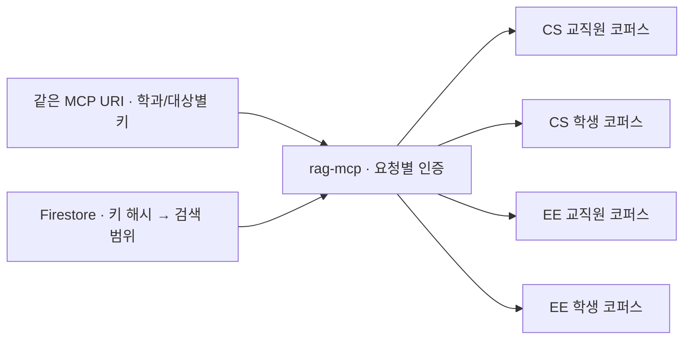

# 통합 MCP 운영

Cloud Run 서비스 `rag-mcp` 하나가 학과별 교직원·학생 검색을 처리한다. 모든 연결에
같은 `<서비스 URL>/mcp`를 사용하고, 기존 학과·대상별 API 키로 검색 범위를 결정한다.
학과를 추가할 때는 코퍼스와 경로 설정을 등록하며 MCP 서비스를 추가로 만들지 않는다.



## 검색 범위

| 인증 정보 | 검색 범위 |
|---|---|
| CS 교직원 키 | CS 교직원 코퍼스와 등록된 CS 드라이브 |
| CS 학생 키 | CS 학생 코퍼스와 등록된 CS 드라이브의 `STUDENT` 문서 |
| EE 교직원·학생 키 | 동일한 규칙으로 EE 범위만 허용 |
| 없거나 등록되지 않은 키 | HTTP 401 |

키는 `Authorization: Bearer <키>` 또는 `X-API-Key: <키>`로 전달한다.
`search` 인자는 `query`, `top_k`, 선택적인 `drive_id`다. 학과·대상·코퍼스를
인자로 지정할 수 없고, 허용되지 않은 `drive_id`는 거부한다.

교직원 코퍼스에는 기존 적재 정책에 따라 교직원 문서와 학생 문서가 함께 들어갈 수
있다. 학생 응답은 문서 상태의 `audience=STUDENT`를 추가로 확인한다. 모든 통합
검색 결과는 문서 상태가 존재하고 허용 드라이브에 속해야 반환한다.

범위는 인증된 HTTP 요청에 저장하고 검색마다 별도 설정을 만든다. 동시 요청에서
전역 코퍼스를 바꾸지 않는다. 검색 캐시도 학과·대상·코퍼스·드라이브·레지스트리 버전으로
분리한다. 따라서 같은 질문을 해도 다른 키의 결과 캐시를 재사용하지 않는다.
실행 서비스 계정은 등록 코퍼스를 조회할 수 있으므로 학과 경계는 이 서버의 인증과
결과 검증으로 강제한다.

## Cloud 설정과 키 관리

- Firestore의 `mcp_registry/current`에는 키의 SHA-256 해시와 검색 범위,
  `revision`, 서비스 URL, 설정 Secret의 고정 버전 경로를 저장한다.
- 원본 학과 설정과 API 키는 Secret Manager의 `rag-mcp-departments`에 저장한다.
  변경할 때 새 버전을 만들고 해당 버전과 경로를 함께 게시한다.
- 관리 도구는 이전 Firestore 수정 시각과 버전을 확인해 동시 변경의 덮어쓰기를 막는다.
  게시에 실패하면 기존 설정이 유지되며 사용하지 않는 Secret 버전이 남을 수 있다.
- 검색 런타임은 Firestore의 해시 경로만 읽는다. 원본 API 키를 환경변수에 넣거나
  Secret Manager를 읽을 권한을 부여하지 않는다.
- 경로 캐시는 인스턴스별 5초다. 만료 후 조회 실패나 잘못된 설정은 HTTP 503으로
  거부하며 오래된 경로를 계속 허용하지 않는다. 키 폐기 시 캐시 유효기간과 이미
  승인된 진행 중 요청의 완료를 고려한다.

관리 콘솔은 `config/common.yaml`의 `MCP_UNIFIED_ENABLED: true`로 통합 모드를
사용한다. 이 모드에서는 Cloud 레지스트리가 등록 학과의 설정 원본이다. 두 대상에
같은 URI를 표시하며 대상별 키를 유지한다. 학과별 관련 소스 정리 시 먼저 해당 대상의
MCP 경로를 비활성화하고 공통 `rag-mcp` 서비스는 유지한다. 데이터 정리 전에 동기화
대상도 해제하며, 일부 단계가 실패하면 재시도에 필요한 학과 설정을 남긴다.

## 실행 권한

전용 서비스 계정은 `rag-mcp-search@<프로젝트 ID>.iam.gserviceaccount.com`이다.
현재 `mcpSearchReader` 커스텀 역할에 다음 조회 권한을 부여한다.

| 권한 | 용도 |
|---|---|
| `aiplatform.ragCorpora.query` | RAG 검색 |
| `aiplatform.ragCorpora.get` | 코퍼스 설정 조회 |
| `aiplatform.endpoints.predict` | 검색어 임베딩 모델 호출 |
| `datastore.entities.get`, `datastore.entities.list` | 경로와 문서 상태 조회 |
| `datastore.databases.get` | Firestore 데이터베이스 조회 |
| `serviceusage.services.use` | 프로젝트 API 사용 |

Cloud Run 진입은 공개하고 애플리케이션이 API 키를 검증한다. 공개 `/health` 응답은
기동 확인용이며, 실제 키 인증과 RAG 검색 성공까지 보장하지 않는다. 관리 콘솔의
설정 변경·Secret 접근 권한은 검색 런타임의 권한과 별도로 관리한다.

## 배포와 전환

초기 전환은 기존 학과 설정과 키를 Cloud 레지스트리에 등록한 뒤 통합 서비스를
검증하고, 레지스트리에 공통 서비스 URL을 저장한 후 콘솔 통합 모드를 켠다.
실행 계정과 위 권한을 준비하고 불변 이미지 digest를 지정해 배포한다.

```powershell
python scripts/deploy_unified_mcp.py --image "<이미지>@sha256:<digest>" --cpu 1 --suffix "unified-<고유값>"
```

스크립트는 `MCP_ROUTING_MODE=registry`, 서비스·리비전 최소 인스턴스 0,
메모리 1 GiB, 동시 요청 40으로 배포한다. 검색 캐시 TTL 기본값은 60초다.
`--image`를 생략하면 현재 소스를 한 번 빌드하고 digest를 고정한다. `--skip-build`는
기존 `mcp:latest`의 digest를 조회한다. 통합 모드의 `deploy_mcp.ps1`도 이 스크립트로
위임하며 Cloud의 경로 설정을 유지한다. `-Dept`를 주어도 재배포 단위는 공통 런타임이다.
운영 배포는 지정 리비전에 트래픽 100%를 명시적으로 전환한다.
`--no-traffic --tag <태그>`로 비교 리비전을 만들고 `--cache-ttl 0`으로 검색 캐시를
끄고 측정할 수 있다. 태그 URL도 같은 키 검증을 거친다.

기존 학과별 MCP 서비스는 클라이언트 전환 동안 최소 인스턴스 0으로 유지한다.
FactChat 등 외부 클라이언트에서 URI를 공통 `/mcp`로 바꾸고 기존 키로 실제 검색을
확인한 뒤 구 서비스를 정리한다. 새 서비스 배포만으로 외부 클라이언트의 URI가
자동으로 바뀌지는 않는다.

## 검증과 CPU 비교

```powershell
python scripts/verify_unified_mcp.py --target "prod=https://<서비스 주소>/mcp" --out docs/verification/unified-production.json
python scripts/verify_unified_mcp.py --target "cpu1=https://<1 CPU 태그 주소>/mcp" --target "cpu2=https://<2 CPU 태그 주소>/mcp" --benchmark --out docs/verification/unified-cpu-comparison.json
```

검증은 동일 URI에 학과·대상별 키로 동시에 접속해 반환 문서의 드라이브와 학생 범위를
확인하고, 누락·잘못된 키의 401 응답을 확인한다. 키와 문서 본문은 보고서에 저장하지
않는다. 검색 결과가 0건인 범위는 정상 문서가 반환되는지 검증한 것으로 해석하지
않으며, 잘못된 범위·메타데이터·캐시 재사용에 대한 단위 테스트를 함께 확인한다.

CPU 비교는 같은 이미지와 메모리, 검색 캐시 비활성화 조건에서 실행한다. 순서를 번갈아
3회 측정해 리비전별 순차 요청 24건과 동시 연결 4개의 요청 8건을 집계한다. 지표는
클라이언트부터의 응답 시간으로 네트워크·Vertex·Firestore 지연을 포함한다. 첫 연결은
통제된 콜드 스타트 측정이 아니며 이 소규모 표본만으로 장기 부하 성능을 단정하지 않는다.

2 vCPU가 단일 검색을 자동으로 빠르게 만드는 것은 아니다. 실제 보고서의 중앙값과
p95, 동시 요청 결과를 기준으로 선택한다. 최소 인스턴스 0에서는 유휴 상태의 상주
인스턴스를 없애는 대신 첫 요청의 시작 지연을 감수한다. CPU를 늘리는 실험과 최소
인스턴스를 늘리는 실험은 각각 측정한다.

## 2026-09-11 적용 결과

운영 URI: `https://rag-mcp-42w47ff6ba-du.a.run.app/mcp`

`rag-mcp-unified-prod-0911`에 트래픽 100%를 전환했다. 설정은 1 vCPU, 1 GiB,
동시 요청 40, 검색 캐시 60초, 최소 인스턴스 0이다. 비교용 태그는 측정 후 제거했다.
기존 4개 MCP도 서비스·리비전 최소 인스턴스가 모두 0인지 다시 확인했다.

| 측정 | 1 vCPU | 2 vCPU |
|---|---:|---:|
| 순차 요청 평균 (각 24건) | 1,111.80 ms | 1,109.40 ms |
| 순차 요청 중앙값 | 1,087.13 ms | 1,029.87 ms |
| 순차 요청 p95 | 1,342.22 ms | 1,504.61 ms |
| 동시 연결 4개 중앙값 (각 8건) | 1,350.10 ms | 1,128.14 ms |

순차 평균은 거의 같고 2 vCPU의 일관된 지연 개선이 확인되지 않아 1 vCPU로 운영한다.
동시 요청 결과는 개선 신호가 있으므로 실제 동시 사용량이 늘면 더 큰 표본으로 다시 측정한다.
원시 시간 표본은 [CPU 비교 보고서](verification/unified-cpu-comparison.json)에 있다.

운영 주소에서 CS·EE 교직원·학생 키 4종을 동시에 사용하고 누락·오류 키 401을 검증했다.
CS는 대상별 2개 질의에서 총 10개 응답 문서의 범위를 확인했고 EE는 0건이었다.
Vertex API로 EE 교직원·학생 코퍼스의 적재 파일이 각각 0개인 것도 확인했다.
자동 검사 275개가 통과했다. 운영 설정과 검색 결과 집계는
[운영 검증 보고서](verification/unified-production.json)에 남겼다.

이후 수행한 [동시 10·20·40개 부하 테스트](verification/unified-load-summary.md)에서는
40개로 급증할 때 가용 인스턴스 부족으로 HTTP 500이 발생했다. 확장 이후 재검증은
120건 모두 성공했다. 따라서 앞의 소규모 CPU 비교를 40개 동시 요청의 안정성 검증으로
해석하면 안 된다.

사용자 요청에 따라 이후 운영 설정을 **2 vCPU / 1 GiB / min 0**으로 변경했고,
`rag-mcp-cpu2-prod-0911b`가 트래픽 100%를 처리한다.
[실제 FactChat 동시 40개 테스트](verification/factchat-cpu2-summary.md)는 교직원에서
29개 정상 완료, 11개 FactChat HTTP 429였다. 학생 챗봇도 접근 해제 후 별도로
40개를 테스트했고 동일하게 29개 정상 완료, 11개 HTTP 429였다.
